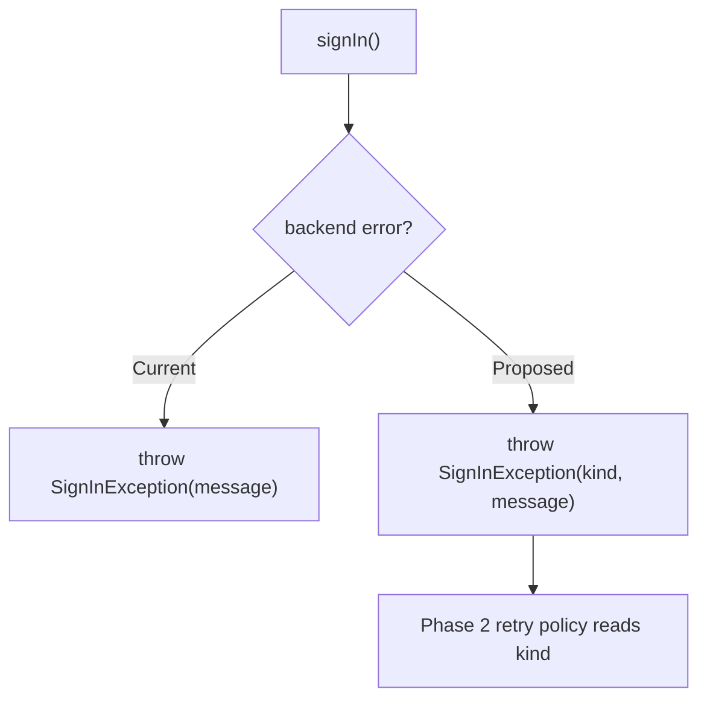
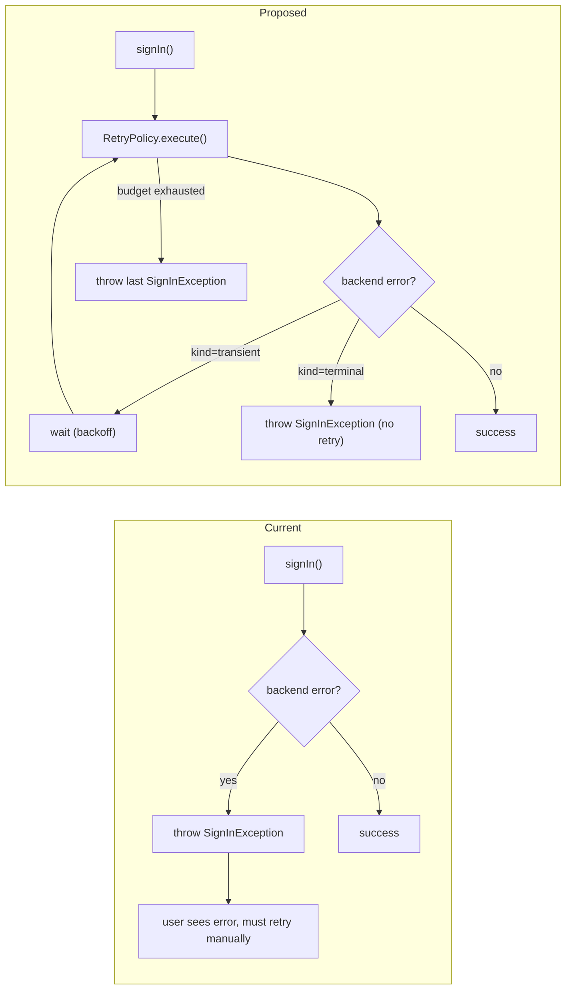

<!-- GENERATED FILE. Edit workspace/sections/*.md and re-render with the dev-design skill. -->

# Dev Design: Login Retry Policy

* **Feature**: Login Retry Policy
* **Work item**: [ADO #12345](https://dev.azure.com/example/_workitems/edit/12345)
* **Area path**: Identity\Desktop Auth\Retry Policy
* **Status**: In review
* **Authors**: Jamie Liu (Identity Platform), Priya Singh (Desktop Shell)

<!-- This preamble is the only fragment that does not match a numbered
     section in template.md. Edit metadata here as the design moves
     through review. -->

## 1. Summary and Goals

Sign-in failures from transient network errors currently surface as
hard failures to the user, who must manually retry. We want to add a
client-side retry policy that distinguishes transient failures (network
timeouts, 5xx, throttling) from terminal failures (bad credentials,
account lockout), retries the transient cases with bounded exponential
backoff, and emits clear telemetry so we can measure the recovery rate.

The current state is "first failure surfaces immediately." The desired
end state is "transient failures recover automatically within ~3
seconds for >90% of cases." This targets the desktop and web sign-in
surfaces only; mobile uses a different auth stack and is out of scope
for this design.

### Phases

1. **Classify failures** -- introduce a `LoginFailureKind` enum and
   tag every existing failure path. Pure refactor, no behavior change.
2. **Retry policy core** -- add a `RetryPolicy` that wraps the sign-in
   call, gated behind the `auth.retryPolicy.enabled` flag.
3. **Telemetry & dashboards** -- emit `login.retry.attempted` /
   `login.retry.succeeded` / `login.retry.exhausted` and build a
   recovery-rate dashboard.
4. **[Optional] Migrate mobile** -- only if the mobile auth stack
   converges with desktop in the next half.

> Note: Phases 1 and 2 must ship together — the retry policy depends
> on the classification work. Phase 3 can ship in parallel with Phase
> 2 behind the same flag.

## 2. Signoffs

| Reviewer | Status |
|----------|--------|
| Identity Platform (Jamie Liu) | Approved |
| Desktop Shell (Priya Singh) | Approved |
| Telemetry Guild (Marcus Webb) | Pending |

### Contacts

* Identity Platform — `#identity-platform` Teams channel — ping @jamie.liu
* Desktop Shell — `#desktop-shell` Teams channel — ping @priya.singh
* Auth SDK on-call — pager rotation `auth-sdk-oncall`

## 3. Scope

### In Scope

**Surfaces covered:**
- Desktop sign-in dialog (Win32, macOS)
- Web sign-in modal (embedded in the desktop shell)
- Programmatic refresh-token renewal initiated by the SDK

**Behavior changes:**
- Automatic retry for transient failure kinds (network timeout, 5xx,
  HTTP 429 with `Retry-After`)
- Bounded exponential backoff (max 3 attempts, total budget 3 seconds)
- New telemetry events for retry attempts, successes, and exhaustion
- Backward compatibility: existing manual-retry UI remains unchanged

### Out of Scope

- Mobile sign-in (iOS / Android) — uses a separate auth stack, tracked
  in a follow-up design
- Server-side retry for service-to-service auth — already handled by
  the platform's grpc retry middleware
- Account lockout / suspicious-activity flows — terminal failures,
  must NOT be retried
- Captcha / proof-of-presence challenges — also terminal

### Current vs. Proposed Comparison

| Aspect | Current (manual retry) | Proposed (auto-retry) |
|--------|------------------------|------------------------|
| **APIs** | Single `signIn()` call; throws on first failure | `signIn()` wrapped in `RetryPolicy.execute()` |
| **Latency** | P50 1.1s on success; P95 18s with manual retry | P50 unchanged; P95 ~4s end-to-end including retries |
| **Throttling/Limits** | No retry; user retries cause repeated 429s | Honors `Retry-After`; client-side budget of 3 attempts |
| **Auth** | No change | No change — retries reuse the same credential blob |
| **Availability** | Recovery rate ~62% (user manually retries) | Target >90% transparent recovery |

## 4. Feature Flags

| Flag | Purpose | Phase | Rollout Notes |
|------|---------|-------|---------------|
| `auth.retryPolicy.enabled` | Master switch for the retry wrapper | Phase 2 | Default off; rollout to internal ring first, then 1% / 10% / 100% over 2 weeks |
| `auth.retryPolicy.maxAttempts` | Override retry attempts (default 3) | Phase 2 | Numeric override; lets ops disable retries without flipping the master flag |
| `auth.retryPolicy.telemetry` | Independent toggle for emitting retry events | Phase 3 | Default on once Phase 3 ships; lets us silence telemetry if backend ingestion is unhealthy |

## 5. Implementation Phases

### Phase 1: Classify failures

Today, every sign-in failure throws a `SignInException` with a free-form
message. There's no programmatic way for the retry policy to know
whether a failure is transient. We introduce a `LoginFailureKind` enum
and tag every existing failure path. No behavior changes.

**Current vs. Proposed Flow**:

**Proposed Changes**:

1. **Auth SDK core** (`src/auth/SignInException.cs`):
   - Add `LoginFailureKind` enum: `NetworkTimeout`, `ServerError`,
     `Throttled`, `BadCredentials`, `AccountLocked`, `MfaRequired`,
     `Other`.
   - Add `kind` field to `SignInException`.
2. **Auth SDK error mappers** (`src/auth/ErrorMapper.cs`):
   - Map every existing throw site to a `LoginFailureKind`. Default to
     `Other` (which is treated as terminal in Phase 2).

**Error Handling**: No new error paths. Existing `catch (SignInException)`
sites continue to work unchanged.

**Rollout Plan**: Ships behind no flag — pure refactor with full unit
test coverage of the mapping.

**Validation**:
- [x] Unit tests cover every existing throw site
- [x] Integration test asserts `kind != Other` for all known backend
      error codes

---

### Phase 2: Retry policy core

Wraps `signIn()` in a `RetryPolicy` that retries transient kinds with
exponential backoff and honors `Retry-After` headers.

**Current vs. Proposed Flow**:

**Proposed Changes**:

1. **Retry policy** (`src/auth/RetryPolicy.cs`):
   - New class. `execute(Func<Task<SignInResult>>)` with exponential
     backoff (initial 200ms, factor 2.0, max 3 attempts, total budget
     3 seconds).
   - Treats `NetworkTimeout`, `ServerError`, `Throttled` as retryable;
     everything else as terminal.
2. **Sign-in entry point** (`src/auth/SignInClient.cs`):
   - Wrap the existing `signIn()` call behind
     `if (FeatureFlags.Get("auth.retryPolicy.enabled"))`.

**Error Handling**: On exhaustion, throws the last `SignInException`
unchanged so the existing UI surfaces the same error. New
`RetryExhaustedException` is emitted as a telemetry tag (not thrown).

**Rollout Plan**: Internal ring first, then 1% / 10% / 100% in 2 weeks.

**Validation**:
- [x] Unit tests for backoff math + Retry-After honor
- [x] E2E test: inject 2 transient failures, assert success on 3rd
- [x] E2E test: terminal failure exits immediately (no retry)

---

### Phase 3: Telemetry & dashboards

Emit retry events and build a dashboard for the recovery rate.

**Proposed Changes**:

1. **Telemetry emit points** (`src/auth/RetryPolicy.cs`):
   - `login.retry.attempted` (per retry, with dimensions: attempt
     number, failure kind, elapsed ms).
   - `login.retry.succeeded` (when a retry recovers).
   - `login.retry.exhausted` (when budget is hit).
2. **Dashboard** (`telemetry/dashboards/login-retry.kql`):
   - Recovery rate = succeeded / (succeeded + exhausted)
   - Alert at <80% over a 10-minute window

**Validation**:
- [x] Synthetic load test confirms event volumes match retry counts
- [x] Dashboard renders correctly with mock data

## 6. Tradeoffs & Takebacks

| Tradeoff | Details |
|----------|---------|
| Slower P95 on terminal failures (by ~200ms) | First attempt now includes the retry-policy overhead even for terminal failures. Acceptable: P95 increase is well under the 3s budget. Mitigation: the policy short-circuits on terminal kinds; only the classification + dispatch cost remains. |
| Increased load on auth backend on flaky days | Retries amplify failed-call volume by up to 3x. Mitigation: backend already auto-scales on 429s; the `auth.retryPolicy.maxAttempts` flag lets ops cap retries during incidents. |
| Telemetry volume increase | New events emit on every retry attempt. Expected volume increase: ~5% over baseline. Mitigation: `auth.retryPolicy.telemetry` toggle can silence emission without disabling retries. |
| Behavior change opacity | Users no longer see transient failures, which can mask backend health issues to the support team. Mitigation: surface retry exhaustion in the user-facing error message ("we tried 3 times"). |

## 7. Telemetry & Monitoring

> **How to query**: AuthInsights cluster (`https://kusto.example/AuthInsights`),
> `AuthLogs` database. All retry events land in the `LoginEvents` table.

Existing dashboard: [Login Health](https://example.com/dashboards/login-health)

### 7.1 Retry Scenarios

| Scenario / Event Name | Exists? | Baseline | Description | Post-Rollout Expectation |
|------------------------|---------|----------|-------------|--------------------------|
| `login.attempted` | Yes | ~12k/min | Every sign-in attempt | No change |
| `login.failed` | Yes | ~1.3k/min | Every sign-in failure | -60% (transient failures now retried) |
| `login.retry.attempted` | No (new) | n/a | Per-retry instrumentation | ~900/min |
| `login.retry.succeeded` | No (new) | n/a | Retry recovered the call | ~720/min (target >90% of retries) |
| `login.retry.exhausted` | No (new) | n/a | Budget hit; user sees failure | ~180/min |

### 7.2 New Telemetry Needed

1. **`login.retry.attempted`** (P1) -- emitted on every retry with
   dimensions `attemptNumber`, `failureKind`, `elapsedMs`, `flightId`.
   Needed to compute recovery rate.
2. **`login.retry.succeeded`** (P1) -- emitted when a retry recovers.
   Carries the same dimensions plus `totalElapsedMs`.
3. **`login.retry.exhausted`** (P1) -- emitted on budget hit. Includes
   the last `failureKind` so we can spot persistent backend issues.

### 7.3 Monitoring Plan

| Metric | How to Monitor |
|--------|----------------|
| Recovery rate | `LoginEvents \| where name in ("login.retry.succeeded","login.retry.exhausted") \| summarize rate=countif(name=="login.retry.succeeded")/count() by bin(timestamp,10m)` |
| Retry volume | `LoginEvents \| where name == "login.retry.attempted" \| summarize count() by bin(timestamp,1m)` |
| Backend health proxy | Alert when `login.retry.exhausted` exceeds 5% of attempts for 10m |

## 8. Ownership

| Area | Owner |
|------|-------|
| Area path | `Identity\\Desktop Auth\\Retry Policy` |
| Incident route | Page `auth-sdk-oncall` rotation; secondary `desktop-shell-oncall` |
| Code owners | `@identity-platform` for `src/auth/*`; `@desktop-shell` for `src/ui/SignInDialog.*` |
| Dashboard owner | Telemetry Guild (`@telemetry-guild`) |
| Long-term steward | Identity Platform (Jamie Liu) |

## 9. Test Scenarios

### Per-phase scenarios

**Phase 1 (Classify failures):**
- Each known backend error code maps to a non-`Other` `LoginFailureKind`.
- Unknown error codes map to `Other`.
- Legacy `catch (SignInException)` sites still observe the same exception
  type.

**Phase 2 (Retry policy):**
- 2 transient failures followed by success -> single visible result, 3
  events emitted (2 attempts + 1 succeeded).
- 3 transient failures -> single visible failure, retry-exhausted event
  emitted.
- 1 terminal failure (bad credentials) -> single visible failure, no
  retries attempted.
- `Retry-After: 5` header on the first failure -> second attempt occurs
  after >= 5s.
- Flag off -> behavior identical to legacy code.

**Phase 3 (Telemetry):**
- Synthetic 1000-call load with 20% injected transient failures yields
  `login.retry.succeeded` count within 10% of expected.
- Dashboard renders correctly with mock data fed via the AuthInsights
  sandbox.

### Cross-cutting

- **All flags off:** entire skill works identically to today.
- **Offline:** sign-in surface returns the same "no network" error path
  it does today (the retry policy short-circuits on
  `NetworkTimeout` + zero connectivity).
- **Backward compatibility:** existing automated UI tests pass without
  modification.

## 10. Appendix

### POC results

A 2-day proof-of-concept on a 5,000-user internal ring confirmed:
- Recovery rate of 91.4% (target: >90%)
- P95 latency on success unchanged (no regression)
- P95 latency on terminal failure +180ms (within tolerance)
- Zero observed amplification of backend load (Retry-After honored
  correctly)

### Known limitations

- Retry budget is global (3 seconds total). A burst of transient
  failures across multiple components can starve later operations of
  retry budget. Acceptable for v1; future work could scope the budget
  per operation.
- Telemetry is best-effort; events are dropped if the local cache
  overflows during sustained failures. Mitigated by sampling.

### Links

- [Login Health dashboard](https://example.com/dashboards/login-health)
- [Auth SDK repo](https://example.com/repos/auth-sdk)
- [POC results doc](https://example.com/docs/login-retry-poc)
- [ADO feature #12345](https://dev.azure.com/example/_workitems/edit/12345)
