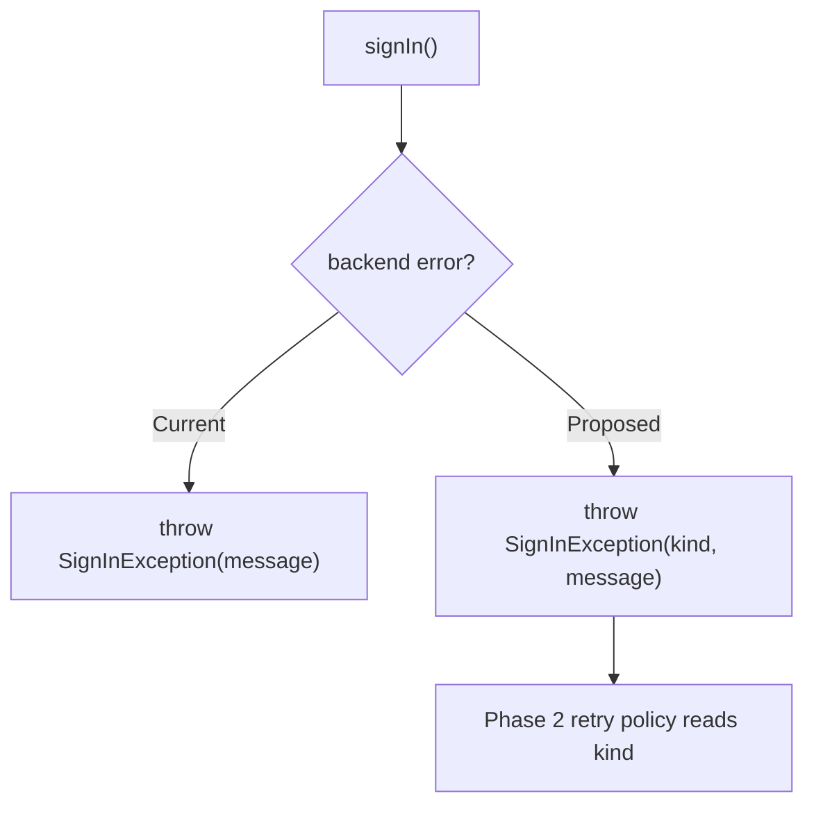
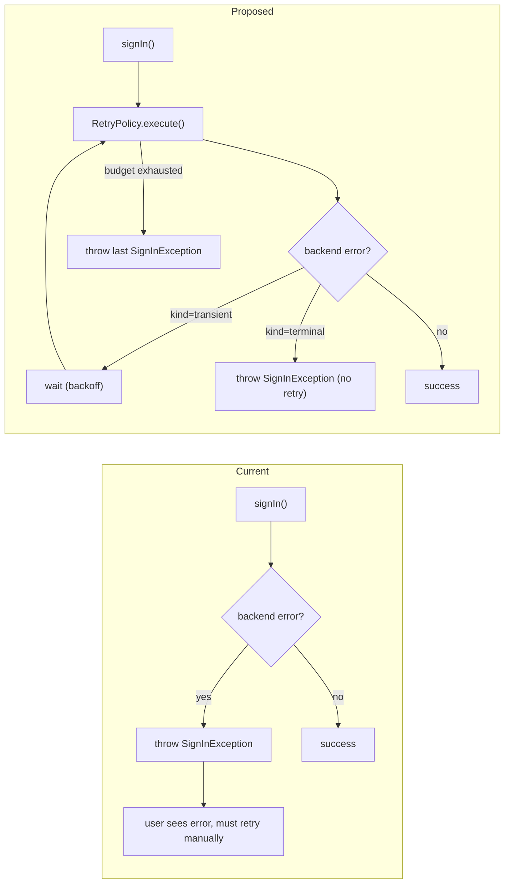

## 5. Implementation Phases

### Phase 1: Classify failures

Today, every sign-in failure throws a `SignInException` with a free-form
message. There's no programmatic way for the retry policy to know
whether a failure is transient. We introduce a `LoginFailureKind` enum
and tag every existing failure path. No behavior changes.

**Current vs. Proposed Flow**:

**Proposed Changes**:

1. **Auth SDK core** (`src/auth/SignInException.cs`):
   - Add `LoginFailureKind` enum: `NetworkTimeout`, `ServerError`,
     `Throttled`, `BadCredentials`, `AccountLocked`, `MfaRequired`,
     `Other`.
   - Add `kind` field to `SignInException`.
2. **Auth SDK error mappers** (`src/auth/ErrorMapper.cs`):
   - Map every existing throw site to a `LoginFailureKind`. Default to
     `Other` (which is treated as terminal in Phase 2).

**Error Handling**: No new error paths. Existing `catch (SignInException)`
sites continue to work unchanged.

**Rollout Plan**: Ships behind no flag — pure refactor with full unit
test coverage of the mapping.

**Validation**:
- [x] Unit tests cover every existing throw site
- [x] Integration test asserts `kind != Other` for all known backend
      error codes

---

### Phase 2: Retry policy core

Wraps `signIn()` in a `RetryPolicy` that retries transient kinds with
exponential backoff and honors `Retry-After` headers.

**Current vs. Proposed Flow**:

**Proposed Changes**:

1. **Retry policy** (`src/auth/RetryPolicy.cs`):
   - New class. `execute(Func<Task<SignInResult>>)` with exponential
     backoff (initial 200ms, factor 2.0, max 3 attempts, total budget
     3 seconds).
   - Treats `NetworkTimeout`, `ServerError`, `Throttled` as retryable;
     everything else as terminal.
2. **Sign-in entry point** (`src/auth/SignInClient.cs`):
   - Wrap the existing `signIn()` call behind
     `if (FeatureFlags.Get("auth.retryPolicy.enabled"))`.

**Error Handling**: On exhaustion, throws the last `SignInException`
unchanged so the existing UI surfaces the same error. New
`RetryExhaustedException` is emitted as a telemetry tag (not thrown).

**Rollout Plan**: Internal ring first, then 1% / 10% / 100% in 2 weeks.

**Validation**:
- [x] Unit tests for backoff math + Retry-After honor
- [x] E2E test: inject 2 transient failures, assert success on 3rd
- [x] E2E test: terminal failure exits immediately (no retry)

---

### Phase 3: Telemetry & dashboards

Emit retry events and build a dashboard for the recovery rate.

**Proposed Changes**:

1. **Telemetry emit points** (`src/auth/RetryPolicy.cs`):
   - `login.retry.attempted` (per retry, with dimensions: attempt
     number, failure kind, elapsed ms).
   - `login.retry.succeeded` (when a retry recovers).
   - `login.retry.exhausted` (when budget is hit).
2. **Dashboard** (`telemetry/dashboards/login-retry.kql`):
   - Recovery rate = succeeded / (succeeded + exhausted)
   - Alert at <80% over a 10-minute window

**Validation**:
- [x] Synthetic load test confirms event volumes match retry counts
- [x] Dashboard renders correctly with mock data
