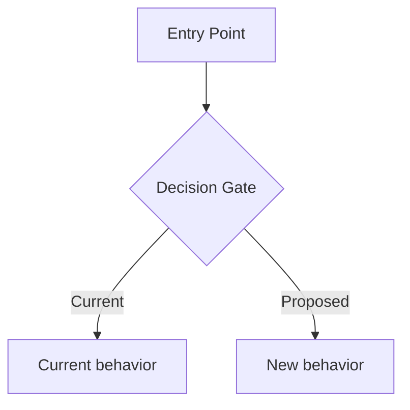

# Dev Design: [Project/Feature Name]

## 1. Summary and Goals

<!-- 1-2 paragraphs: What is the problem or opportunity? What does this project do at a high level? What is the current state and what is the desired end state? Call out key constraints (e.g., environment restrictions, backward compatibility, rollout strategy). -->

[Describe the current system/behavior, the motivation for the change, and the desired outcome. Be specific about which environments, surfaces, or user segments are affected. State whether this targets new behavior only or includes migration of existing data/state.]

### Phases

<!-- OPTIONAL — only when the feature is complex enough to warrant phasing. Skip
this subsection entirely for a simple feature (small surface, single deliverable,
single team). When kept: break the work into sequenced phases. Each phase should
be independently shippable or at least independently testable. Call out ordering
dependencies between phases. -->

1. **[Phase Name]** -- [One-line description of what this phase delivers and why it must come first/can be parallelized.]
2. **[Phase Name]** -- [One-line description.]
3. **[Phase Name]** -- [One-line description.]
4. **[Optional] [Phase Name]** -- [One-line description. Mark phases as optional if they depend on product decisions or are stretch goals.]

> Note: [Call out any sequencing constraints, e.g., "Phases 1 and 3 must ship together to avoid a broken experience." or "Phases can be worked on in parallel."]

---

## 2. Signoffs

<!-- List the people or teams whose review and approval are needed before this design ships. -->

| Reviewer | Status |
|----------|--------|
| [Team/Role] ([Name]) | |
| [Team/Role] ([Name]) | |
| [Team/Role] ([Name]) | |

### Contacts

<!-- Key points of contact for dependent teams, services, or APIs. Include links to channels, distribution lists, or individuals. -->

* [Team/Service] - [How to reach them, e.g., Teams channel link, alias] - ping @[Name]

---

## 3. Scope

### In Scope

<!-- Be explicit about what this project covers. Group by category (e.g., data types, surfaces, flows) for clarity. -->

**[Category, e.g., "Data types covered"]:**
- [Item 1]
- [Item 2]

**[Category, e.g., "Surfaces and flows"]:**
- [Surface/flow 1]
- [Surface/flow 2]
- Backward compatibility for [existing behavior]
- Telemetry and monitoring

### Out of Scope

<!-- Explicitly list what is NOT covered to prevent scope creep and set expectations. -->

- [Item 1 -- brief reason why it's excluded]
- [Item 2 -- brief reason why it's excluded]
- [Item 3 -- brief reason why it's excluded]

### [Optional: Current vs. Proposed Comparison]

<!-- If replacing or migrating from an existing system, a side-by-side comparison helps reviewers understand what changes and what trade-offs exist. -->

| Aspect | Current ([System A]) | Proposed ([System B]) |
|--------|----------------------|-----------------------|
| **APIs** | [Description] | [Description] |
| **Latency** | [Description] | [Description] |
| **Throttling/Limits** | [Description] | [Description] |
| **Auth** | [Description] | [Description] |
| **Availability** | [Description] | [Description] |

---

## 4. Feature Flags

<!-- List all feature flags used to control rollout. Include existing flags being reused and new flags being introduced. For simple (non-phased) designs, the `Phase` column is optional — fold it into `Rollout Notes`. -->

| Flag | Purpose | Phase | Rollout Notes |
|------|---------|-------|---------------|
| `[flagName]` | [What it controls] | Phase [N] | [Dependencies, ordering constraints, or isolation notes] |
| `[flagName]` | [What it controls] | Phase [N] | [Dependencies, ordering constraints, or isolation notes] |

---

## 5. Implementation Phases

<!-- For phased designs: one `### Phase N:` subsection per phase with motivation, current vs proposed flow, specific code/config changes, and validation criteria. For simple (non-phased) designs: rename this heading to `## 5. Implementation` and render a single flat block (motivation paragraph + Proposed Changes + Error Handling + Validation) without `### Phase N:` subheadings. Use diagrams where the flow is non-trivial. -->

### Phase 1: [Phase Name]

<!-- 1-2 paragraphs: Why is this phase needed? What breaks or degrades without it? What does it enable? -->

[Describe the problem this phase solves and the high-level approach.]

**Current vs. Proposed Flow**:

<!-- Use a diagram (Mermaid, ASCII, or link to image) to illustrate the flow change. -->

**Proposed Changes**:

<!-- List specific files, components, or services being modified and what changes. Be precise enough that a reviewer can find the code. -->

1. **[Component/file]** (`path/to/file.ext`):
   - [Change description]
   - [Change description]

2. **[Component/file]** (`path/to/file.ext`):
   - [Change description]

**Error Handling**: [Describe new error paths introduced or existing ones affected. If no new error paths, state that explicitly.]

**Rollout Plan**: [Any phased rollout, ring-based deployment, or coordination needed with other teams.]

**Validation**:
- [ ] [Test scenario 1]
- [ ] [Test scenario 2]
- [ ] [Backward compatibility verification]

---

### Phase 2: [Phase Name]

[Repeat the same structure for each phase.]

**Proposed Changes**:

1. **[Component/file]** (`path/to/file.ext`):
   - [Change description]

**Validation**:
- [ ] [Test scenario 1]
- [ ] [Test scenario 2]

---

### Phase N: [Optional/Pending] [Phase Name]

<!-- For phases that depend on product decisions, mark them clearly and describe what work is needed if the decision goes either way. -->

[Describe the phase and the pending decision.]

**If [Decision A]**: [Implications and work required.]

**If [Decision B]**: [Implications and work required.]

---

## 6. Tradeoffs & Takebacks

<!-- Be honest about what gets worse, what behavior changes, and what is being intentionally left behind. This builds trust with reviewers and surfaces concerns early. -->

| Tradeoff | Details |
|----------|---------|
| [Short label] | [Description of the tradeoff, who it affects, and any mitigations] |
| [Short label] | [Description of the tradeoff, who it affects, and any mitigations] |
| [Short label] | [Description of the tradeoff, who it affects, and any mitigations] |

---

## 7. Telemetry & Monitoring

<!-- Describe how you will measure success and detect regressions. Organize by scenario type. -->

> **How to query**: [Point to the data source, cluster, database, or dashboard where these metrics live.]

Existing dashboard: [Link to monitoring dashboard]

### 7.1 [Category] Scenarios

<!-- For each telemetry event: does it exist already or is it new? What does it measure? What should happen to it after rollout? -->

| Scenario / Event Name | Exists? | Baseline | Description | Post-Rollout Expectation |
|------------------------|---------|----------|-------------|--------------------------|
| `[event_name]` | Yes/No | [P95 or volume] | [What it measures] | [Expected change: increase, decrease, replaced by X, etc.] |
| `[event_name]` | Yes/No | [P95 or volume] | [What it measures] | [Expected change] |

### 7.2 New Telemetry Needed

<!-- Call out gaps in existing telemetry and what new events/scenarios need to be created. -->

1. **`[new_event_name]`** (Priority) -- [What it measures, what dimensions to track (latency, status codes, failure subtypes), and why it's needed.]

### 7.3 Monitoring Plan

| Metric | How to Monitor |
|--------|----------------|
| [What to watch for] | [Query, dashboard, or alert to use] |
| [What to watch for] | [Query, dashboard, or alert to use] |

### 7.4 Performance Tracking

<!-- Compare latency/throughput before and after each phase. Reference baseline numbers. -->

**Pre-rollout Baseline**:
- `[scenario]`: [P95 latency or throughput]
- `[scenario]`: [P95 latency or throughput]

**After Phase 1**:
- Compare [new metric] against baseline [old metric]
- Confirm [expected telemetry change]

**After Phase N**:
- [Comparison plan]

---

## 8. Ownership

<!-- State who owns the code, telemetry, and incidents for this work. -->

- **Area path**: `[Organization\Team\SubTeam]`
- **Incident route**: [Service, Team, or on-call rotation]

[Describe ownership for new code files, new telemetry scenarios, and how they map to existing ownership structures.]

---

## 9. Test Scenarios

<!-- Organize test cases by phase for phased designs (per-phase H3 tables) or as a single table for simple designs. Include a cross-cutting subsection for scenarios that span multiple phases. Number test cases for easy reference in reviews and bug reports. -->

### 9.1 [Phase 1 Name]

| # | Scenario | Expected Behavior |
|---|----------|-------------------|
| 1 | [User action + context + flag state] | [What should happen] |
| 2 | [Backward compatibility scenario] | [Existing behavior preserved] |
| 3 | [Error/edge case] | [Graceful degradation or fallback] |

### 9.2 [Phase 2 Name]

| # | Scenario | Expected Behavior |
|---|----------|-------------------|
| 4 | [Scenario description] | [Expected behavior] |
| 5 | [Scenario description] | [Expected behavior] |

### 9.N Cross-Cutting

| # | Scenario | Expected Behavior |
|---|----------|-------------------|
| N | [Scenario that spans multiple phases or is environment-wide] | [Expected behavior] |
| N+1 | [All flags OFF / default state] | [Entire codebase unchanged, all existing flows intact] |
| N+2 | [Offline / degraded network] | [Graceful degradation] |

---

## 10. Appendix

<!-- Use this section for deep dives, POC results, resolution comparisons, platform limitations, or any supplementary technical detail that supports the design but would clutter the main sections. -->

### 10.1 [Topic, e.g., "Resolution & Quality Comparison"]

[Detailed findings, data tables, or test results.]

### 10.2 [Topic, e.g., "POC Results"]

[Description of proof-of-concept work, what was validated, and readiness for production.]

### 10.3 [Topic, e.g., "Known Platform Limitations"]

[Limitations discovered during investigation, with workaround options.]
